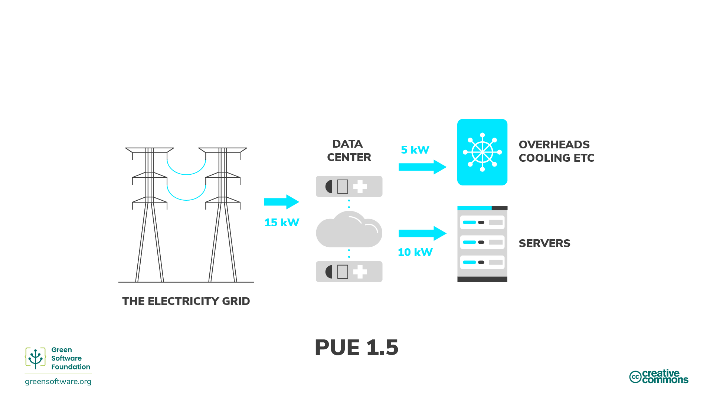

import Quiz from "/src/components/Quiz";

:::note
Esta es una traducción contribuida por la comunidad. Posee soporte limitado y puede no concordar con la versión en Inglés más reciente del curso.
:::

:::tip Principle

_Usar la menor cantidad de energía posible._

:::

## Introducción

La energía es la habilidad de realizar trabajo. Hay muchas formas diferentes de energía, tales como el calor, la energía eléctrica y la química, y un tipo de energía puede ser convertido a otro. Por ejemplo, convertimos energía química del carbón a energía eléctrica. En otras palabras, la electricidad es energía secundaria convertida desde otro tipo de energía. De este modo, podemos considerar la energía como una medida de la electricidad usada.

Todo software, desde aplicaciones móviles hasta el entrenamiento de modelos de Aprendizaje Automático ejecutándose en centros de datos, consume electricidad. Una de las mejores maneras de reducir el consumo de electricidad (y, subsecuentemente, las emisiones de carbono del software) es hacer las aplicaciones más eficientes con la energía. Sin embargo, allí no termina nuestra responsabilidad.

Los profesores del software verde toman responsabilidad por la energía consumida por sus productos y los diseñan para consumir lo menos posible. Debemos asegurarnos de que, en cada paso del proceso de construcción, haya el menor desperdicio posible y que la mayoría de la energía vaya al paso siguiente.

El paso final del flujo de trabajo es representado por el usuario final de tu producto, no el producto terminado en sí. Esto significa que nuestro objetivo no es simplemente escribir el código más eficiente con la energía, o "el software más verde", sino pensar en el usuario final y cómo asegurarse de que no esté creando emisiones innecesarias.

Esto puede significar tomar acciones como **trabajar por lotes** para tomar ventaja de la **proporcionalidad energética**, o modificar la manera en la que el usuario interactúa con tu software. Observemos algunos de estos conceptos y algunas formas en las que puedes volverte más eficiente con la energía en cada etapa del flujo de trabajo, hasta el consumidor final.

## Conceptos clave

### Combustibles fósiles y fuentes de energía altas en carbono

Casi todo la electricidad es producida a través de la quema de combustibles fósiles, [usualmente carbón](https://ourworldindata.org/grapher/world-electricity-by-source). Los combustibles fósiles son hechos de plantas y animales en descomposición. Estos combustibles se encuentran en la corteza de la Tierra y contienen carbono e hidrógeno, los cuales pueden ser quemados para obtener energía. El carbón, el aceite y el gas natural son ejemplos de combustibles fósiles.

La mayoría de la gente cree que la electricidad es limpia. Nuestras manos no se ensucian cuando conectamos algo a la pared, y nuestros portátiles no necesitan exhostos. Sin embargo, debido a que la mayoría de la electricidad viene de la quema de combustibles fósiles, y el abastecimiento de energía es la [única causa más significativa](https://www.eea.europa.eu/data-and-maps/daviz/change-of-co2-eq-emissions-2#tab-chart_4) de emisiones de carbono, podemos trazar una relación directa entre electricidad y emisiones de carbono. De este modo, la electricidad puede ser considerada una delegada del carbono.

Si nuestra meta es ser eficientes con el carbono, entonces esto significa que nuestra meta también es ser eficiente con la energía, ya que la energía es una delegada del carbono. Esto es, usar la menor cantidad posible de energía por unidad de trabajo.

### Fuentes de energía bajas en carbono

Las energías limpias provienen de fuentes renovables y de cero emisiones, las cuales no contaminan la atmósfera al ser usadas y ahorran energía a través de prácticas eficientes con la energía. Hay solapos entre energías limpias, verdes y renovables. He aquí cómo las podemos diferenciar:

- **Energías limpias** - no emiten carbono. Ejemplo: energía nuclear.
- **Energías verdes** - poseen fuentes naturales
- **Energías renovables** - poseen fuentes que no expirarán. Ejemplos: energía solar, energía eólica

### Medida de la energía

- La energía es medida en julios (J), la medida de energía del [SI](https://es.wikipedia.org/wiki/Sistema_Internacional_de_Unidades).
- La potencia se mide en vatios, donde 1 vatio (W) es una razón correspondiente a 1 julio por segundo.
- Un kilovatio (kW) es, por lo tanto, otra razón correspondiente a 1000 julios por segundo.
- Un kilovatio-hora (kWh) es una medida de la energía (J) correspondiente a 1 kilovatio de potencia sostenido por una hora.

## Cómo mejorar la eficiencia energética

Ahora que sabemos cómo es producida la energía y los costos asociados en términos de emisiones (basados en si se usan fuentes de energía bajas o altas en carbono), veamos algunas de las formas en las que los profesores del software verde pueden mejorar la eficiencia energética. Entender la efectividad del consumo eléctrico y la proporcionalidad energética significa que puedes tomar mejores decisiones en términos de cómo usar la energía de la forma más eficiente posible y desperdiciar menos.

### Efectividad del consumo eléctrico

La industria de los centros de datos usa la métrica de efectividad del consumo eléctrico [Power Usage Effectiveness](https://datacenters.lbl.gov/sites/default/files/WP49-PUE%20A%20Comprehensive%20Examination%20of%20the%20Metric_v6.pdf) (PUE), desarrollada por Green Grid en 2006, para **medir la eficiencia energética de los centros de datos**. Específicamente, esto tiene que ver con cuánta energía usan los equipos de cómputo en comparación con la que usan refrigeraciones y otros excedentes que ayudan a los equipos de cómputo a funcionar. Cuando el PUE de un centro de datos es cercano a 1.0, el proceso de computación está usando casi toda la energía. Cuando el PUE es 2.0, significa que se require un vatio adicional de IT power para enfriar y distribuir potencia al IT equipment por cada vatio de IT power que usa.

Another way to think of PUE is as a multiplier to your application’s energy consumption. So, for example, if your application consumed 10 kWh and the PUE of the data center where it is running is 1.5, then the actual consumption from the grid is 15 kWh: 5kWh goes towards the operational overhead of the data center, and 10 kWh goes to the servers that are running your application.

### Energy proportionality

[Energy proportionality](https://research.google/pubs/pub33387/), first proposed in 2007 by engineers at Google, measures **the relationship between power consumed by a computer and the rate at which useful work is done** (its utilization).

Utilization measures how much of a computer's resources are used, usually given as a percentage. A fully utilized computer running at its maximum capacity has a high percentage, while an idle computer with no utilization has a lower percentage.

The relationship between power and utilization is not proportional. Mathematically speaking, proportionality between two variables means their ratios are equivalent. For example, at 0% utilization, a computer can draw 100W; at 50%, it draws 180W; and at 100%, it draws 200W. The relationship between power consumption and utilization is not linear and does not cross the origin.

Because of this, the more we utilize a computer, the more efficient it becomes at converting electricity to practical computing operations. One way to improve hardware efficiency is to run the workload on as few servers as possible, with the servers running at the highest utilization rate, maximizing energy efficiency.

#### Static power draw

The static power draw of a computer is **how much electricity is drawn when in an idle state**. The static power draw varies by configuration and hardware components, but all parts have some static power draw. This is one of the reasons that PCs, laptops, and end-user devices have power-saving modes. If the device is idle, it will eventually trigger a hibernation mode and put the disk and screen to sleep or even change the CPU's frequency. These power-saving modes save on electricity, but they have other trade-offs, such as a slower restart when the device wakes up.

Servers are usually not configured for aggressive or even minimal power saving. Many use cases running on servers demand total capacity as quickly as possible because the server needs to respond to rapidly changing demands, which leads to many servers in idle modes during low-demand periods. An idle server has a carbon cost from both the embedded carbon as well as its inefficient utilization.

## Summary

- Electricity is a proxy for carbon, so building an application that is energy efficient is equivalent to building an application that is carbon efficient.
- Green software takes responsibility for its electricity consumption and is designed to consume as little as possible.
- Quantifying the energy consumption of an application is a step in the right direction to start thinking about how an application can operate more efficiently. However, understanding your application's energy consumption is not the only story. The hardware your software is running on uses some of the electricity for operational overhead. This is called power usage efficiency (PUE) in the cloud space.
- The concept of energy proportionality adds another layer of complexity since hardware becomes more efficient at turning electricity into useful operations the more it's used.
- Understanding this gives green software practitioners a better insight into how their application behaves with respect to energy consumption in the real world.

## Quiz

<Quiz
  QuizList={[
    {
      question:
        "Why do we sometimes say that electricity is a proxy for carbon?",
      answers: [
        {
          text: "Electricity is a form of energy and all kinds of energy produces carbon",
          isCorrect: false,
        },
        {
          text: "Using electricity produces carbon emissions",
          isCorrect: false,
        },
        {
          text: "Fossil fuels are burned to produce electricity",
          isCorrect: true,
        },
      ],
    },
    {
      question: "What are some examples of fossil fuels?",
      answers: [
        { text: "Carbon and hydrogen", isCorrect: false },
        { text: "Coal, oil and natural gas", isCorrect: true },
        { text: "Both of the above", isCorrect: false },
      ],
    },
    {
      question: "What is clean energy?",
      answers: [
        { text: "Energy that comes from renewable sources", isCorrect: false },
        {
          text: "Energy that doesn’t produce carbon emissions",
          isCorrect: true,
        },
        { text: "Both the above", isCorrect: false },
      ],
    },
    {
      question: "What does PUE (power usage effectiveness) measure?",
      answers: [
        { text: "Data center energy efficiency", isCorrect: true },
        { text: "Energy consumption of an application", isCorrect: false },
        {
          text: "Amount of energy used in overheads combined with that consumed by servers",
          isCorrect: false,
        },
      ],
    },
    {
      question:
        "Which of the following is something that is measured by energy proportionality?",
      answers: [
        {
          text: "Relationship between the energy used in overheads and what goes towards the servers running an application",
          isCorrect: false,
        },
        {
          text: "The percentage of a computers available resources that are being used",
          isCorrect: false,
        },
        {
          text: "Relationship between the power consumed by a computer and the rate at which useful work is done",
          isCorrect: true,
        },
      ],
    },
    {
      question: "What is the SI unit of energy?",
      answers: [
        {
          text: "Watts",
          isCorrect: false,
        },
        {
          text: "Kilowatts",
          isCorrect: false,
        },
        {
          text: "Joules",
          isCorrect: true,
        },
      ],
    },
    {
      question: "Which application consumes the most energy?",
      answers: [
        {
          text: "An application that consumes 20kWh in a data center with a PUE of 1",
          isCorrect: true,
        },
        {
          text: "An application that consumes 15kWh in a data center with a PUE of 1.2",
          isCorrect: false,
        },
        {
          text: "An application that consumes 10kWh in a data center with a PUE of 1.5",
          isCorrect: false,
        },
      ],
    },
    {
      question: "What is static power draw?",
      answers: [
        {
          text: "The carbon cost of applications being left on standby",
          isCorrect: false,
        },
        {
          text: "The electricity being drawn by an application in an idle state",
          isCorrect: true,
        },
        {
          text: "The electricity used by an application in eco mode",
          isCorrect: false,
        },
      ],
    },
  ]}
/>
